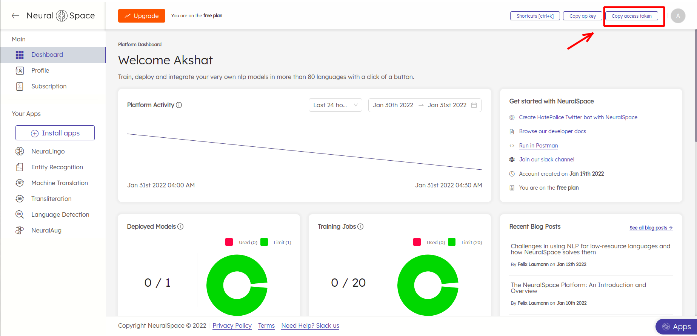
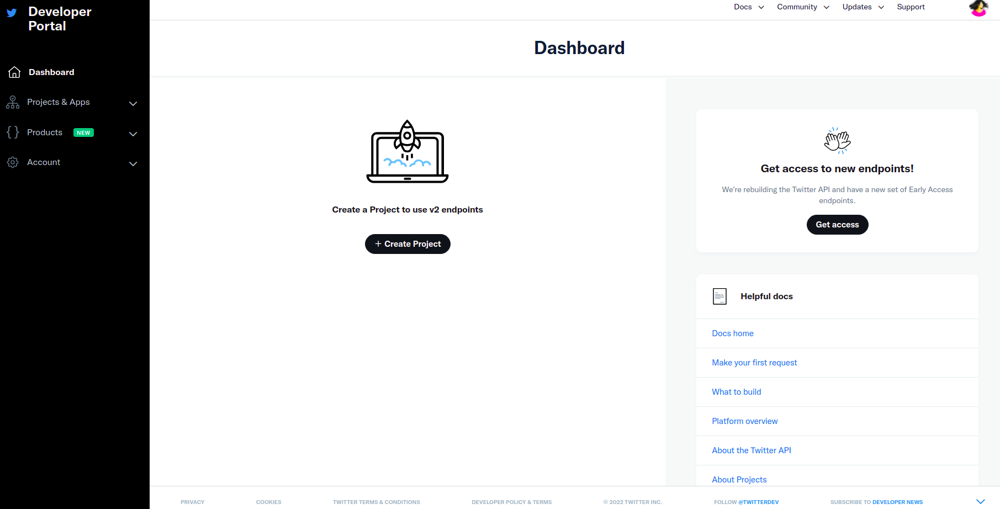
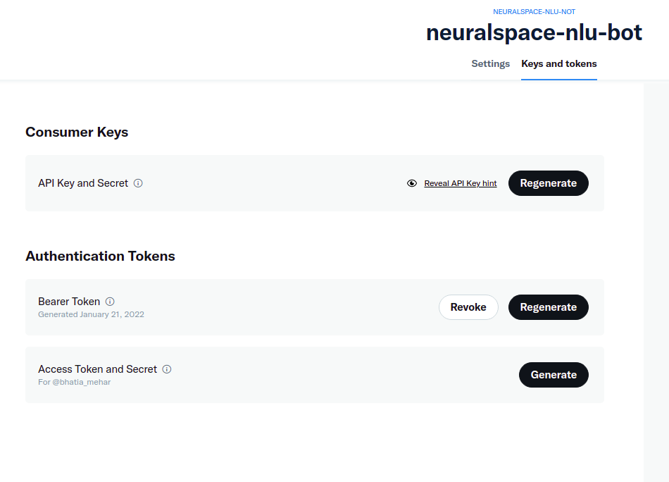

# Neuralspace-Transliteration-Tutorial

This repository contains a tutorial to create a transliteration twitter bot using NeuralSpace's Transliteration APIs.

You can set your own custom trigger phase, and whenever anyone on twitter replies to a tweet mentioning this phrase, the bot transliterates the tweet in reply.

Let us get started!


## Install requirements

To make the Twitter Bot in Python, we will need to install some packages. Let us make a conda environment. You can use Python == 3.7.

```
conda create --name neuralspace-nlu-bot python=3.7
conda activate neuralspace-bot
pip install -r requirements.txt
```
As you see, we will use `tweepy` to post on twitter, a package that provides a very convenient way to use the Twitter API. Here is the [documentation](https://tweepy.readthedocs.io/en/latest/api.html). 


## Creating NeuralSpace API Authentication Credentials
To use transliteration APIs, you will need NeuralSpace's access token. 
1. Go to [platform.neuralspace.ai](platform.neuralspace.ai) and sign in to your account. If you haven't created an account signup!
2. Click on `Copy access token` as shown in the image below.

3. Save this access token and update it in `src/config.yaml` `NEURALSPACE_ACCESS_TOKEN`.
4. You can track your API usage and limits from the Neuralspace platform.

## Creating Twitter API Authentication Credentials
The Twitter API requires that all requests use OAuth to authenticate. So you need to create the required authentication credentials to be able to use the API. These credentials:

- CONSUMER_KEY
- CONSUMER_SECRET
- ACCESS_TOKEN
- ACCESS_TOKEN_SECRET

If you already have a Twitter user account, then follow these steps to create the key, token, and secrets. Otherwise, you have to sign up as a Twitter user before proceeding.

### Step 1: Apply for a Twitter Developer Account
Go to the [Twitter developer](https://developer.twitter.com/en) site to apply for a developer account. Here, you have to select the Twitter user responsible for this account. It should probably be you or your organization. 

Twitter then requests some information about how you plan to use the developer account. You have to specify the developer account name and whether you are planning to use it for personal purpose or for your organization.

### Step 2: Create an Application
Twitter grants authentication credentials to apps, not accounts. An app can be any tool or bot that uses the Twitter API. So you need to register your an app to be able to make API calls.

To register your app, go to your [Twitter apps page](https://developer.twitter.com/en/portal/projects-and-apps) and select the Create an app option.


You need to provide the following information about your app and its purpose:

- **App name**: a name to identify your application (such as examplebot)
- **Application description**: the purpose of your application (such as an example bot for a Python article)
- **Your or your application’s website URL**: required, but can be your personal site’s URL since bots don’t need a URL to work
- **Use of the app**: how users will use your app (such as This app is a bot that will automatically respond to users)

### Step 3: Create the Authentication Credentials

To create the authentication credentials, go to your Twitter apps page. Here’s what the Apps page looks like:

Here you’ll find the Dashboard button of your app. Clicking this button takes you to the next page, where you can generate the credentials.

By selecting the Keys and tokens tab, you can generate and copy the key, token, and secrets to use them in your code:

After generating the credentials, save them in the `config.yaml` file to later use them in your code. </br>
Save API key in `CONSUMER_KEY`, api key secret in `CONSUMER_SECRET`, access token in `TWITTER_ACCESS_TOKEN`, access token secret in `ACCESS_TOKEN_SECRET` and Bearer token in `BEARER_TOKEN`.  

## Start the Transliteration Bot

After following all the above steps, start your bot using the following commands.
```bash
cd src
python main.py -k "@neuralspace transliterate"
```

You can use any keyword as a wake phrase for the bot. Whenever anyone mentions this phrase as a reply to a hindi tweet, the bot will reply back with it's transliteration in english.

You can change the source and target language from `src/config.yaml`. Please check the languages we support for transliteration [here](https://docs.neuralspace.ai/transliteration/language-support).


